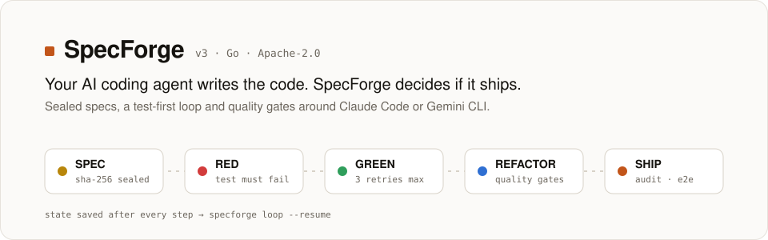
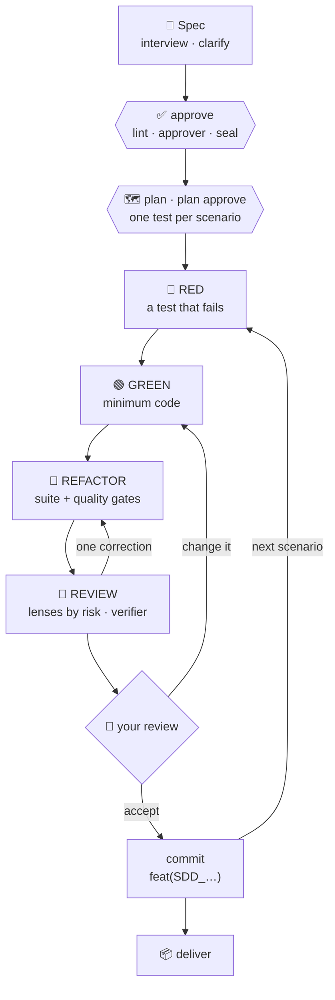

<p align="center">
  
</p>

<p align="center">
  <a href="https://github.com/jefmonjor/specforge/actions/workflows/ci.yml"></a>
  <a href="https://github.com/jefmonjor/specforge/releases/latest"></a>
  <a href="go.mod"></a>
  <a href="LICENSE"></a>
</p>

<p align="center">
  <b>
  <a href="#-quickstart">Quickstart</a> ·
  <a href="#-how-it-works">How it works</a> ·
  <a href="#-your-files-what-to-edit">What to edit</a> ·
  <a href="#-rewriting-a-legacy-system">Legacy rewrites</a> ·
  <a href="USER_GUIDE.md">User guide</a>
  </b>
</p>

---

**AI coding agents are fast and confidently wrong.** They write tests that pass before any code exists, guess at requirements nobody settled, edit the test until it passes and claim files they never wrote.

**SpecForge is one Go binary that puts your agent on an assembly line and checks its work.** You approve a specification; SpecForge seals it. Then it drives [Claude Code](https://docs.anthropic.com/en/docs/claude-code) or [Gemini CLI](https://github.com/google-gemini/gemini-cli) through **Red → Green → Refactor**, one scenario at a time. The agent writes the code. SpecForge runs the tests, compares the files on disk, fingerprints the tests and runs the quality gates. **Nothing moves forward on the agent's word.**

> The agent is a fast junior developer. SpecForge is the senior who reads the diff, runs the tests and asks you when something was never decided.

- ✋ **It asks instead of guessing.** Every answer ends with a JSON contract: done, a question for you, or blocked.
- 🔒 **Specs are sealed.** Edit an approved spec and the loop stops until you approve it again.
- 🧪 **Real tests, real results.** A RED test must compile and fail; GREEN may not touch it. Tests that were already broken are named, kept apart and never blamed on the agent.
- ⚖️ **Review in proportion, every finding proved.** A change's risk comes from what git says it touched. Review lenses scale with it, and a finding that does not point at a changed line is discarded.
- 🔍 **An independent verifier.** For risky work, a second agent probes the specification itself in a copy of your project, and every failure comes with the command that reproduces it.
- 🛡 **A guard on the agent's shell, and a way back.** `git reset --hard`, `rm -rf`, `DROP TABLE` and friends are blocked before they run, in the command and in the scripts, files and package scripts it runs. The loop checkpoints your work before every agent turn; `specforge restore` brings it back.
- 🏛 **Legacy rewrites without invention.** The old code is read-only and every source the agent cites is opened.
- 📦 **Traceable hand-over.** Each scenario is linked to its test, its commit, its gates, its risk and its review.

## 🚀 Quickstart

**1 · Install.** Download your binary from the [latest release](https://github.com/jefmonjor/specforge/releases/latest):

```bash
R=https://github.com/jefmonjor/specforge
R=$R/releases/latest/download
# or darwin-amd64, linux-amd64,
# linux-arm64
F=specforge-darwin-arm64
curl -Lo specforge $R/$F
chmod +x specforge
sudo mv specforge /usr/local/bin/
specforge version
```

<details>
<summary><b>Windows, or build it from source</b></summary>

**Windows:** download `specforge-windows-amd64.exe`, rename it to `specforge.exe` and put it in a folder on your `PATH`. SpecForge never edits your `PATH` or registry.

**From source** (Go version from [`go.mod`](go.mod)):

```bash
git clone \
  https://github.com/jefmonjor/specforge
cd specforge
make build      # ./specforge
```

</details>

You also need **Claude Code** (`claude`) or **Gemini CLI** (`gemini`) installed and signed in, `git`, and your stack's test runner. SpecForge drives the agent you already use: no API keys.

**2 · Configure once per machine:**

```bash
specforge init
```

**3 · Build a feature, scenario by scenario:**

```bash
cd my-project
specforge setup
specforge doctor
specforge spec new "Password reset"
specforge spec interview 0001
specforge spec approve 0001
specforge plan 0001
specforge plan approve 0001
specforge loop 0001
specforge deliver 0001
```

- **`setup`** writes `specforge.yaml`, your stack's rules in `CLAUDE.md` or `GEMINI.md`, the destructive-command guard as your agent's hook, and `.specforge/` in `.gitignore`. Your code is never touched.
- **`doctor`** checks the agent, git, your test runner and every gate's tool, and says how to install what is missing.
- **`spec new`** creates `specs/0001-password-reset.md` from the template.
- **`spec interview`** has the agent ask you one question at a time and write each answer into that file. You can also just edit it by hand.
- **`spec approve`** refuses while a `TODO` or an open question is left, then records you as approver and seals the file.
- **`plan`** has the agent write `plan.md`: where the code goes and one test per scenario. Edit it if you like, then **`plan approve`**.
- **`loop`** runs Red → Green → Refactor for each scenario, reviews it in proportion to its risk, then asks for your review and makes one commit per scenario.
- **`deliver`** writes `DELIVERY.md`, `trace.json` and `PR_BODY.md` from what SpecForge recorded, and proposes stacked slices when the work is too big for one review.

### Three ways in

**A feature in an existing repository** is the sequence above.

**A new project** with the tooling already wired:

```bash
mkdir shop && cd shop && git init
specforge setup --new react
npm install && npm test
```

`--new` takes `java`, `react`, `python` or `go` ([what each one brings](#-starting-from-scratch)).

**A rewrite of a legacy system**, Java 6 to 21 for example:

```bash
mkdir payroll && cd payroll && git init
specforge setup --new java \
  --legacy ../legacy-payroll
specforge legacy scan
specforge legacy map
specforge spec from-legacy "Net pay"
```

Then `spec clarify`, `spec approve`, `plan` and `loop` as usual ([details](#-rewriting-a-legacy-system)).

## 🛑 See it say no

These are real runs, shortened to fit a phone. The first two stop before a single token is spent.

**An open question blocks approval.**

```text
$ specforge spec approve 0001

✗ The specification is not ready
  for approval
    specs/0001-password-reset.md
    open question: Does a newer link
    invalidate the previous one?
  → fix each line above and approve
    again
  (exit 3)
```

**Someone edited the approved spec? The seal catches it.**

```text
$ sed -i "s/31 minutes/24 hours/" \
    specs/0001-password-reset.md
$ specforge loop 0001

✗ The specification changed after
  approval
  → revert the edit, or approve the
    new version with `spec approve`
  (exit 3)
```

**The agent asks instead of inventing.** GREEN for scenario 1 had already implemented scenario 2, so no honest failing test was possible. Instead of faking a RED, the agent asked:

```text
Scenario 2/2 · RED · An unknown code
is refused

✗ A question needs your answer
    The behaviour for SDD_0001_002
    already exists in
    internal/checkout/order.go, so the
    new test would pass instead of
    failing in RED. How should I
    proceed?
  → answer in questions.md, then
    `specforge loop --resume`
  (exit 5)
```

More, including a full Java 6 → 21 migration, in [docs/DEMO.md](docs/DEMO.md).

## 🔧 How it works



For each stage, what SpecForge checks itself:

| Stage | SpecForge verifies |
| :--- | :--- |
| **Spec** | No `TODO`, no open question, every scenario has a `When` and a `Then`. Who approved it. A SHA-256 seal. |
| **Plan** | Only `plan.md` changed; every scenario has a planned test; you approved it. |
| **🔴 Red** | A test named with the scenario's marker (`SDD_0001_003`) exists, compiles, runs and **fails on an assertion**. One that passes too early goes to you. |
| **🟢 Green** | The tests are byte-for-byte as RED left them, and they pass. Failures are fed back, up to 3 attempts. |
| **🔵 Refactor** | The whole suite passes, except tests that already failed before the loop (named from the runner's report), and no quality gate blocks. A gate whose tool is missing shows ⚠ *skipped*, never ✓. |
| **⚖️ Risk** | Passive, medium or high, from the paths and lines git says the scenario touched. The agent can raise it with a reason, never lower it. |
| **🔎 Review lenses** | None for a passive change, one for a medium one, four for a high one. Each lens is read-only and its JSON must validate; a finding whose proof is not a changed line is discarded; inferential ones go to a refuter. What blocks gets **one** correction, within a line budget, then a check of those findings only. |
| **🔍 Verifier** | For high risk: a verdict for the scenario and every invariant it names, probed in a disposable copy of the project, the only place an agent may run commands without asking. Every failure comes with its command and output, and SpecForge runs the command again before believing it. Your project must stay untouched. |
| **🗺️ Plan surfaces** | Every file the agent changes is in the approved plan, or you are asked. A refused file must be put back. |
| **⏩ Side by side** | With `loop.parallel`, scenarios whose plan files do not overlap run at once, each in its own sandbox. Their work comes back in order, the whole suite runs over the combination, and each one still gets your review and its own commit. |
| **👀 Review** | You accept, say what should change, or send it back to RED. Then one commit per scenario. |
| **❓ Questions** | Asked at the terminal, or written to `questions.md` with exit code 5 in CI. Your answer is reused in every later prompt. |

The agent's claims are checked against the disk: the files it says it wrote, the test results from each runner's machine-readable report (`go test -json`, JUnit XML, Vitest and Jest JSON), and a snapshot of the project before and after every turn.

## 📂 Your files: what to edit

Everything lives in your repository, next to your code (`0001-slug` stands for each specification's number and name). The files you work in:

- 📝 **The specification** · `specs/0001-slug.md`<br>
  Edit it freely before approving. To change an approved one, run `spec change 0001 "<what to change>"` (or edit it) and `spec approve` again: every scenario keeps its marker and its tests, and the loop redoes only what changed.
- 🗺️ **The plan** · `specs/0001-slug/plan.md`<br>
  After `plan`, edit what you like, then `plan approve`.
- ❓ **Questions waiting for you** · `specs/0001-slug/questions.md`<br>
  Written when nobody was at a terminal. Replace `_awaiting an answer_` and run the same command again.
- ⚙️ **Project settings** · `specforge.yaml`<br>
  Stack, review, commits, models per phase, risk rules, lenses, verifier, plan surfaces, delivery budget, parallel scenarios, the guard, gate thresholds, migration. `setup` writes it with every key commented.
- 🤖 **Your agent's instructions** · `CLAUDE.md`, `GEMINI.md`<br>
  Write anything outside the SpecForge block; `setup` refreshes only the block.
- 📚 **Lessons** · `specs/LESSONS.md`<br>
  What the agent learnt after a failed attempt. Prune or reword them.
- 🏛 **The legacy capability map** · `docs/legacy/CAPABILITIES.md`<br>
  Review it before writing specifications from it.

SpecForge writes these itself; read them, but leave them alone:

- The `<!-- seal: … -->` line at the end of a spec or plan. Never edit it: approve again.

And in `specs/0001-slug/`:

- `approvals.md`: every approval and what changed in it.
- `decisions.md`: every question and answer, reused in later prompts.
- `interview.jsonl`: the interview transcript.
- `review/SDD_…json` and `verify/SDD_…json`: each scenario's lens review and verification, with every discarded finding and why.
- `DELIVERY.md`, `trace.json`, `PR_BODY.md`: the hand-over, rewritten by each `deliver`.

`setup` also adds the guard to `.claude/settings.json` or `.gemini/settings.json`, keeping the rest of the file.

The loop state for `--resume` lives in `.specforge/`, which `setup` adds to `.gitignore`.

**How do I…** change an approved spec, add a scenario, redo one, answer a question in CI? See the [recipes](USER_GUIDE.md#18-recipes).

### Anatomy of a specification

Twelve numbered sections, each with a `TODO` to replace. The ones that drive the loop:

````markdown
## 4. Invariants
- **INV-01**: A reset link works once.

## 6. Scenarios
```gherkin
Feature: Password reset

  Scenario: INV-01 a used link fails
    Given a reset link that was used
    When the user opens it again
    Then it is refused: LINK_USED
```

## 12. Open questions
- [NEEDS CLARIFICATION]: Does a
  newer link invalidate the old one?
````

Each Gherkin scenario becomes one test, one RED → GREEN → REFACTOR and one commit. Keep it to **one behaviour per scenario**: one `When`, at least one `Then`, in business words. Every invariant deserves a scenario that tries to break it. Write what you do not know as `[NEEDS CLARIFICATION]`, and `spec clarify` asks you for each one. The [user guide](USER_GUIDE.md#6-specifications-spec) has the whole template and the lint rules.

## 🏛 Rewriting a legacy system

Migrations are where agents invent the most: they "modernise" rules nobody asked to change and cite code that does not exist. SpecForge treats the legacy repository as **read-only evidence**. The agent reads it; SpecForge hashes it before and after every turn and refuses any change.

| Step | What SpecForge checks |
| :--- | :--- |
| `legacy scan` | Measured, no agent: build tool, declared Java release, frameworks found **from imports** (Servlet, JSP, Struts, EJB, JPA, Hibernate, Spring, JDBC, Log4j 1, JUnit 3…) and what each one means for Java 21. |
| `legacy map` | Every `` `path:line` `` the agent cites is opened. A missing file or a line past the end sends the map back. |
| `spec from-legacy` | The same check, one capability per spec, a `13. Legacy sources` section, and every oddity in the old code turned into a question for you. |
| `plan` · `loop` | The agent reads the cited sources to reproduce the behaviour; the legacy code must stay byte-for-byte unchanged. |
| Migration gate | The build declares the target release and no source imports a forbidden package (`javax.servlet`, Log4j 1, `Vector`…). ArchUnit checks the layers. |

The settings live in `specforge.yaml` (`setup --legacy` writes them):

```yaml
migration:
  legacy: ../legacy-payroll
  java_release: 21
```

The full walkthrough is in the [user guide](USER_GUIDE.md#15-legacy-rewrites-legacy-spec-from-legacy), and a real run in [docs/DEMO.md](docs/DEMO.md#7-a-legacy-rewrite-java-6--21).

## 🧱 Quality gates

REFACTOR runs every gate that applies to your stack. A gate that cannot run is **skipped**, shown with ⚠, never as a pass; `--strict` makes it block.

| Stack | Gates |
| :--- | :--- |
| **Go** | golangci-lint (else `go vet`) · jscpd |
| **Node / React** | `npm run lint` · jscpd · Knip · Stryker |
| **Java** | PMD (Maven) · jscpd · migration · ArchUnit in the suite |
| **Python** | Ruff · jscpd |

Thresholds (duplication 0 %, mutation score 80) and `strict` live in `specforge.yaml`. Mutation testing is slow, so it runs from medium risk up (`quality.mutation_from`). Node tools run with `npx --no-install`, so nothing is downloaded during the loop.

### 🧰 Starting from scratch

`setup --new` writes a project skeleton with the tooling the loop drives. Each one was installed and run end to end with the versions it pins.

| `--new` | You get |
| :--- | :--- |
| `java` | Java 21 Maven, JUnit 6, AssertJ, ArchUnit layer rules, PMD |
| `react` | Vite 7, React 19, strict TypeScript, Vitest 4.0, Testing Library, ESLint, Knip, jscpd, Stryker |
| `python` | `src/` layout, pytest, Ruff |
| `go` | `go.mod`, golangci-lint v2 |

## 📖 Every command

<details>
<summary><b>Show the full list</b></summary>

| Command | Does |
| :--- | :--- |
| `init` | Picks your agent and language, once per machine. |
| `setup` | Prepares a repository and installs the guard. `--new <stack>` starts a project; `--legacy <path>` makes it a rewrite; `--no-guard`. |
| `doctor` | Checks the machine and the project, with install hints. Exit 4 when something required is missing. |
| `spec new` | A numbered specification from the template. |
| `spec interview` | Completes it, one question per turn. `--chat` hands the terminal to the agent instead. |
| `spec clarify` | Asks each open question, writes the decision in its place, and has the agent apply it everywhere it matters. |
| `spec lint` | What blocks approval, and advice. |
| `spec approve` | Review gate: lint, approver, seal, change history by marker. |
| `spec change` | Applies a change request to a specification, approved or not, asking what it leaves open. |
| `spec list` | Number, state and title of each spec. |
| `spec from-legacy` | A specification drafted from the legacy code. |
| `legacy scan` | The legacy inventory, measured. |
| `legacy map` | The legacy capability map, every source checked. |
| `plan` · `plan approve` | The technical plan and its approval. |
| `loop` | Red → Green → Refactor → review. `--resume`, `--restart`, `--scenario N --from green`, `--review scenario\|risk\|off`, `--no-commit`, `--strict`. |
| `deliver` | The hand-over: report, trace and PR body. `--slices` writes one PR body per proposed slice. |
| `review` | The review lenses over your whole branch, read-only. A documentation-only branch needs none. |
| `verify` | The independent verifier over a whole specification. |
| `guard` | The destructive-command guard, run by your agent's hook: the command, and the scripts and files it runs. `--selftest` proves it blocks. |
| `restore` | Lists the checkpoints the loop saves before each agent turn, and brings one back. |
| `audit` | Adversarial security review of your branch; fails closed. |
| `e2e` | Checks each scenario in a real Chrome, Chromium or Edge, with a screenshot per step. |
| `version` | Version, commit and build date. |

Global flags: `--non-interactive` · `--json` · `--quiet` · `--verbose` · `--debug` · `--trace-io`.

</details>

## 📏 The CLI contract

| Exit code | Meaning |
| :---: | :--- |
| `0` | Done |
| `1` | Unexpected error or bad usage |
| `2` | A gate said no: tests, quality, review, verifier, security, E2E, a refused file, a blocked agent; the guard blocking a command |
| `3` | The spec or the loop state needs attention |
| `4` | A tool or setting is missing |
| `5` | A question awaits your answer |
| `130` | Interrupted; the saved state is valid |

Status goes to stderr and data to stdout. Prompts, templates and messages are in English or Spanish; Gherkin in any language Cucumber supports.

## 🧩 Under the hood

SpecForge applies to itself the architecture it asks of your code: a pure domain, use cases behind small ports, adapters at the edges and a composition root in `cmd/`.

```text
cmd/         CLI, composition root
internal/
  domain/    pure: spec, tdd, risk,
             review, guard, change,
             verification, legacy, …
  app/       use cases: tddloop,
             reviewer, verifier,
             doctor, guardhook,
             planning, deliver, …
  ports/     what use cases need
  adapters/  agent CLI, runners,
             gates, git, browser
assets/      prompts, rules,
             templates, scaffolds
```

```bash
make lint test build
```

Releases are built by [GoReleaser](.goreleaser.yaml) when a `v*` tag is pushed.

## 📍 Status

SpecForge 6 keeps the one rule, **verify, don't trust**, and makes the checking proportional: cheap for documentation, thorough for the code that handles money, secrets and permissions. CI runs `gofmt`, `go vet`, golangci-lint, `go mod tidy`, the race detector with a 75 % coverage floor, and builds for Linux, macOS and Windows.

- [x] Verified loop, sealed specs, questions with resume
- [x] Plan, per-scenario review and commits, traceable delivery
- [x] Turn-based interview, fail-closed audit, browser checks
- [x] Legacy rewrites with verified sources; migration gate
- [x] Scaffolds for Java 21, React, Python and Go
- [x] Known failures as evidence; risk tiers; a model per phase; `doctor`
- [x] Edit surfaces from the plan; delivery budget and stacked slices
- [x] Review lenses with proof checked against the diff; refuter; one correction
- [x] Independent verifier in a copy; destructive-command guard
- [x] Blind double review; scenarios side by side · [docs/V6_PLAN.md](docs/V6_PLAN.md)
- [x] Proven end to end with Claude Code: baseline, risk, lenses, two scenarios side by side, the verifier and the guard · [docs/DEMO.md](docs/DEMO.md#8-specforge-6-risk-lenses-verifier-parallel-guard)
- [x] 6.1: the guard reads what a command runs; checkpoints and `restore`; copies that write each byte once; scenarios keep their marker through any change, and `spec change` applies change requests · [docs/DEMO.md](docs/DEMO.md#9-specforge-61-closing-the-gaps)

The reasoning behind every item is in [docs/IMPROVEMENT_PLAN.md](docs/IMPROVEMENT_PLAN.md). Ideas and bugs are welcome in [Issues](https://github.com/jefmonjor/specforge/issues).

## 🤝 Contributing & license

Read [CONTRIBUTING.md](CONTRIBUTING.md), the [Code of Conduct](CODE_OF_CONDUCT.md) and the [security policy](SECURITY.md) before opening a pull request. The full manual is the [user guide](USER_GUIDE.md).

Licensed under [Apache 2.0](LICENSE). Binary distributions must include [NOTICE](NOTICE) and [THIRD-PARTY-NOTICES.md](THIRD-PARTY-NOTICES.md).

<p align="center"><sub>Built by <a href="https://www.jefmonjor.dev">Jefferson Montesdeoca</a> · <a href="https://github.com/jefmonjor">@jefmonjor</a></sub></p>
