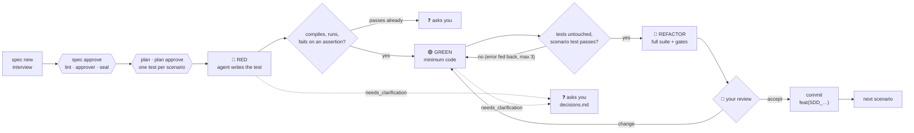

<p align="center">
  
</p>

<p align="center">
  <a href="https://github.com/jefmonjor/specforge/actions/workflows/ci.yml"></a>
  <a href="https://github.com/jefmonjor/specforge/releases/latest"></a>
  <a href="go.mod"></a>
  <a href="LICENSE"></a>
  
</p>

<p align="center">
  <a href="#-see-it-say-no">Demo</a> ·
  <a href="#-how-it-works">How it works</a> ·
  <a href="#-rewriting-a-legacy-system">Legacy rewrites</a> ·
  <a href="#-quickstart">Quickstart</a> ·
  <a href="#-commands">Commands</a> ·
  <a href="USER_GUIDE.md">User guide</a>
</p>

---

**AI coding agents are fast and confidently wrong.** They write tests that pass before any code exists, guess at requirements nobody settled, edit the test until it passes, and claim files they never wrote.

**SpecForge is a single Go binary that puts your agent on an assembly line and checks its work.** You agree on a specification and approve it; SpecForge seals it. Then it drives [Claude Code](https://docs.anthropic.com/en/docs/claude-code) or [Gemini CLI](https://github.com/google-gemini/gemini-cli) through **Red → Green → Refactor**, one scenario at a time. The agent writes the code. SpecForge runs the tests, compares the files on disk, fingerprints the tests and runs the quality gates. Nothing moves forward on the agent's word.

> The agent is a fast junior developer. SpecForge is the senior who reads the diff, runs the tests and asks you when something was never decided.

## 🛑 See it say no

These are real runs of SpecForge 4. The first two stop before a single token is spent.

**An open question blocks approval. The agent never builds on a guess.**

```text
$ specforge spec approve 0001

✗ The specification is not ready for approval
    specs/0001-password-reset.md
    open question: Does a newer link invalidate the previous one? [open-question]
  → fix each line above (`specforge spec lint` shows the advice too) and approve again
  (exit 3)
```

**Someone edited the approved specification? The seal catches it.**

```text
$ sed -i "s/31 minutes/24 hours/" specs/0001-password-reset.md
$ specforge loop 0001

✗ The specification changed after approval
    the specification changed after it was sealed (sealed 8483154cbd9a, now da34d8aa9982)
  → revert the edit or approve the new version with `specforge spec approve`
  (exit 3)
```

**The agent asks instead of inventing.** In this live run with Claude Code, GREEN for scenario 1 had already implemented the behaviour of scenario 2, so no honest failing test was possible. Instead of weakening the code to fake a RED, the agent asked. In CI the question goes to a file and the run exits with code 5. You answer it there or at a terminal, and `--resume` continues the same step.

```text
Scenario 2/2 · RED · An unknown code is refused (INV-01)
  … claude is working (RED)

✗ A question needs your answer
    The behaviour for scenario SDD_0001_002 already exists in internal/checkout/order.go
    (Apply returns ErrUnknownCode and leaves the total unchanged), so the new test should
    pass instead of failing in RED. How should I proceed?
  → write the answer in place of the placeholder in specs/0001-discount-codes/questions.md
    (or run the command again in a terminal), then `specforge loop --resume`
  (exit 5)
```

## 🔧 How it works



| Stage | What the agent does | What SpecForge verifies itself |
| :--- | :--- | :--- |
| **Spec** | Interviews you one question at a time (`spec interview`) and writes each answer into a 12-section template. | `spec approve` refuses a `TODO`, an open question or a scenario without `When`/`Then`; records who approved; seals the content with SHA-256. The loop runs only an approved, unchanged spec. |
| **Plan** | Drafts `plan.md`: components, one test per scenario, interfaces, risks. | Only `plan.md` may change; every scenario marker must be placed; you approve it (sealed) before the loop uses it. |
| **🔴 Red** | Writes one test named with the scenario marker (`SDD_0001_003`). | The files it lists really changed; a test with the marker exists; the filtered run compiles, runs it and **fails on an assertion**. A test that passes too early goes to you. |
| **🟢 Green** | Writes the minimum code. | The test files are byte-for-byte as RED left them (*tampering* stops the loop); the scenario's tests pass. Failures are fed back, up to 3 attempts. |
| **🔵 Refactor** | Fixes the suite or the findings, only when something blocks. | The whole suite passes and no quality gate blocks. A gate whose tool is missing shows ⚠ *skipped*, never ✓. |
| **👀 Review** | — | You accept the scenario, type what should change (back to GREEN) or send it back to RED. Then its files become one commit: `feat(SDD_0001_003): <title>`. |
| **❓ Questions** | Answers `needs_clarification` instead of guessing, at any phase. | You answer once, at the terminal or in `questions.md`; the answer lands in `decisions.md` and in every later prompt. |
| **📚 Lessons** | After a rejected attempt, writes the one-sentence rule that would have avoided it. | Kept in `specs/LESSONS.md` per stack, deduplicated, at most 30, shown in later prompts. |
| **↩ Resume** | — | State saved atomically after every step. `--resume` re-checks the seal; an amended spec redoes only the scenarios whose text changed. |

Test results come from each runner's machine-readable report (`go test -json`, Surefire/JUnit XML, Vitest and Jest JSON, pytest JUnit XML), so "did not compile", "nothing ran" and "failed on an assertion" are told apart.

## 🏛 Rewriting a legacy system

Moving a Java 6 servlet application to Java 21 is where agents invent the most: they "modernise" rules nobody asked to change and cite code that does not exist. SpecForge treats the legacy repository as **read-only evidence**. The agent reads it (`--add-dir` for Claude Code, `--include-directories` for Gemini CLI); SpecForge hashes it before and after every turn and refuses any change.

```bash
mkdir payroll && cd payroll && git init
specforge setup --new java --legacy ../legacy-payroll   # Java 21 + JUnit + ArchUnit + PMD, migration in specforge.yaml
specforge legacy scan                                    # docs/legacy/INVENTORY.md, measured, no agent
specforge legacy map                                     # docs/legacy/CAPABILITIES.md: business capabilities, each rule cited
specforge spec from-legacy "Net pay calculation"         # the behaviour as it is today, with its sources
specforge spec clarify 0001                              # you decide every oddity the agent found
specforge spec approve 0001 && specforge plan 0001 && specforge loop 0001
```

| Step | What SpecForge checks itself |
| :--- | :--- |
| **Inventory** | Build (Maven, Gradle, Ant), declared Java release (lowest wins), frameworks found **from imports**: Servlet, JSP, Struts, EJB, JPA, Hibernate, Spring, JDBC, JAX-RPC/WS, JAXB, JMS, Log4j 1, JUnit 3/4, `Vector`/`Hashtable`, `Date`/`Calendar`; and what each one means for Java 21. |
| **Capability map** | Every `` `path:line` `` the agent cites is opened: a file that does not exist or a line past its end sends the map back. |
| **Specification from legacy** | The same citation check, a mandatory `13. Legacy sources` section, the template lint, and one capability per specification. Whatever the code does that nobody can explain (a dead branch, a magic number, floating-point money) becomes an open question for you, never a guess. |
| **Plan and loop** | The agent reads the cited sources to reproduce the behaviour, and the legacy repository must stay byte-for-byte unchanged. |
| **Migration gate** | The build must declare the target release, and no Java source may import a forbidden package: by default the `javax.*` that Jakarta renamed, Log4j 1, JUnit 3, `Vector` and `Hashtable`. ArchUnit enforces the layers on every test run. |

## 🧰 Commands

| | Command | What it gives you |
| :---: | :--- | :--- |
| 🧭 | `init` | Picks your agent and language, once per machine. No API keys, no PATH edits. |
| 🏗️ | `setup` | Writes `specforge.yaml`, a managed block of rules and your stack's standard in `CLAUDE.md`/`GEMINI.md` (the rest of the file stays yours) and `.specforge/` in `.gitignore`. Never touches your code. `--new java\|react\|python\|go` starts an empty project with the tooling already wired. |
| 🏛 | `legacy scan · legacy map · spec from-legacy` | The inventory of a legacy codebase, its capability map and one specification per capability, every source citation checked against the legacy code. |
| 📝 | `spec new · interview · clarify · lint · approve · list` | The specification lifecycle: a numbered file from the template, an interview run by SpecForge that asks one question per turn and writes each answer into the file, open questions answered one by one and written back as decisions, the lint, and the approval gate that seals it and records what changed since the last approval. |
| 🗺️ | `plan · plan approve` | The agent drafts where the code goes, with one planned test per scenario, and may write nothing but the plan. You review and approve it before any code exists; the loop follows it. |
| 🔁 | `loop` | The Red → Green → Refactor line described above, then your review of each scenario and one commit per scenario. `--resume`, `--restart`, `--scenario N --from green`. |
| 📦 | `deliver` | `DELIVERY.md`, `trace.json` and `PR_BODY.md`, built only from what SpecForge recorded: approvals, one row per scenario with its tests, commit and gates, the decisions, what is still open. It keeps your repository's PR template. |
| 🛡 | `audit` | Adversarial security review of your branch: reconnaissance, a red-team hunter and a blue-team validator. Every answer must match a JSON schema, or the audit fails closed. Doubtful findings are questions for you. |
| 🌐 | `e2e` | Verifies each scenario in a real Chrome, Chromium or Edge through [chromedp](https://github.com/chromedp/chromedp). The agent picks typed actions; SpecForge validates each one (known element, same origin) and checks each `Then` against evidence itself. A screenshot per step. |

## 🚀 Quickstart

**1. Install the binary** from the [latest release](https://github.com/jefmonjor/specforge/releases/latest):

```bash
# macOS (Apple Silicon). Swap the suffix for darwin-amd64, linux-amd64 or linux-arm64.
curl -L -o specforge https://github.com/jefmonjor/specforge/releases/latest/download/specforge-darwin-arm64
chmod +x specforge && sudo mv specforge /usr/local/bin/
```

On Windows, download `specforge-windows-amd64.exe`, rename it to `specforge.exe` and put it in a folder on your `PATH`.

**2. Run the line on a feature:**

```bash
specforge init                              # once per machine: agent and language
cd my-project && specforge setup            # once per repository
specforge spec new "Password reset"         # specs/0001-password-reset.md
specforge spec interview 0001               # one question at a time; the answers go into the file
specforge spec approve 0001                 # review gate R0: lint, approver, seal
specforge plan 0001                         # where the code goes; then: specforge plan approve 0001
specforge loop 0001                         # Red → Green → Refactor → your review → one commit per scenario
specforge audit                             # security review of your branch
specforge e2e 0001 --url http://localhost:3000
specforge deliver 0001                      # DELIVERY.md, trace.json, PR_BODY.md
```

### What you need

| Required | Optional, unlocks more |
| :--- | :--- |
| [Claude Code](https://docs.anthropic.com/en/docs/claude-code) (`claude`) **or** [Gemini CLI](https://github.com/google-gemini/gemini-cli) (`gemini`) on your `PATH`, signed in · `git` · your stack's test runner | Chrome, Chromium or Edge for `e2e` · `golangci-lint`, `ruff`, `jscpd`, `knip`, `stryker` for the quality gates |

## 🧱 Quality gates by stack

| Gate | Go | Node / React | Java | Python |
| :--- | :---: | :---: | :---: | :---: |
| Lint | `golangci-lint`, else `go vet` | `npm run lint` (ESLint + `tsc`) | PMD (`maven-pmd-plugin`) | Ruff (from `.venv` first) |
| Duplicate code (threshold, default 0 %) | jscpd | jscpd | jscpd | jscpd |
| Dead code | — | Knip | — | — |
| Mutation score (threshold, default 80) | — | Stryker | — | — |
| Migration (release and forbidden imports) | — | — | when `migration:` is set | — |
| Architecture | — | — | ArchUnit, in the test suite | — |

Node tools run with `npx --no-install`: nothing is downloaded during the loop. Python runs the `.venv`'s pytest and Ruff when there is one; Maven and Gradle prefer `mvnw`/`gradlew`. Thresholds and `strict` mode live in `specforge.yaml`.

### Starting from scratch: `setup --new`

Every scaffold was installed and run end to end before shipping, with the versions it pins:

| Stack | What you get |
| :--- | :--- |
| `java` | Java 21 Maven: JUnit 6, AssertJ, ArchUnit rules for a hexagonal layout and against Java EE leftovers, PMD |
| `react` | Vite 7, React 19, TypeScript strict, Vitest 4.0 + Testing Library, ESLint, Knip, jscpd, Stryker |
| `python` | `pyproject.toml` with a `src/` layout, pytest, Ruff (pycodestyle, pyflakes, isort, bugbear, pyupgrade, naming) |
| `go` | `go.mod` and a `golangci-lint` v2 configuration |

## 📏 The CLI contract

- **Exit codes**: `0` ok · `1` error · `2` a gate said no · `3` the specification or loop state needs attention · `4` a tool or setting is missing · `5` a question awaits your answer · `130` interrupted.
- **Streams**: status on stderr, data on stdout. `--json` for data and errors, `--quiet`, `--verbose`, `--non-interactive`, `--trace-io` (every prompt and answer in the log file).
- **Languages**: prompts, templates and messages in English or Spanish (`language:`); Gherkin in any language Cucumber supports.

## 🧩 Under the hood

SpecForge applies to itself the architecture it asks of your code: a pure domain, use cases behind small ports, adapters at the edges and a composition root in `cmd/`.

```text
cmd/                  CLI and composition root: signals → context, errors → exit codes
internal/
  domain/             pure: spec (official Gherkin parser, seal, lint), tdd, stack, quality, legacy, security, e2e
  app/                use cases: tddloop, specs, planning, interview, migrate, scaffold, setup, audit, e2erun, deliver
  ports/              the interfaces the use cases need
  adapters/           agent CLI, process runner, test runners, gates, git, browser, files, logging
  config/ ui/         settings resolution; terminal output and diagnoses
assets/               embedded prompts, rules, standards, audit method, templates and scaffolds (en, es)
```

```bash
git clone https://github.com/jefmonjor/specforge.git && cd specforge
make test     # go test -race -cover ./...  (real go, git and Chromium where installed)
make build    # version, commit and date injected with -ldflags
```

## 📍 Status & roadmap

SpecForge 5 keeps the v4 core and its one rule, **verify, don't trust**, and brings back what v3 did well: legacy migration and ready-made projects. CI runs `gofmt`, `go vet`, `golangci-lint`, `go mod tidy`, the race detector with a 70 % coverage floor and builds for Linux, macOS and Windows.

- [x] Verified loop: real test reports, file snapshots, test fingerprints, response contract, questions with resume
- [x] Specification lifecycle with lint, approval and a line-ending-proof seal
- [x] Fail-closed audit and per-scenario browser verification
- [x] Plan step (R1) and per-scenario review (R2) with a commit per scenario
- [x] `spec clarify`, approval history with scenario deltas, curated lessons
- [x] `deliver`: a delivery report and PR body traced from scenario to test to commit
- [x] Turn-based interview owned by SpecForge, with a transcript and a lint-checked end
- [x] Legacy rewrites: inventory, capability map and specifications with verified sources; read-only legacy; migration gate
- [x] Scaffolds for Java 21, React, Python and Go; PMD lint for Java; virtual environments and build wrappers
- [ ] A published v5.0.0 release

A full session with Claude Code, from an empty specification to the pull request body, is in [docs/DEMO.md](docs/DEMO.md). The plan, with the reasoning behind each item, is in [docs/IMPROVEMENT_PLAN.md](docs/IMPROVEMENT_PLAN.md). Ideas and bug reports are welcome in [Issues](https://github.com/jefmonjor/specforge/issues).

## 🤝 Contributing & license

Read [CONTRIBUTING.md](CONTRIBUTING.md), the [Code of Conduct](CODE_OF_CONDUCT.md) and the [security policy](SECURITY.md) before opening a PR. The full manual is the [user guide](USER_GUIDE.md).

Licensed under [Apache 2.0](LICENSE). Binary distributions must include [NOTICE](NOTICE) and [THIRD-PARTY-NOTICES.md](THIRD-PARTY-NOTICES.md), which lists every module compiled into the binary with its license.

<p align="center"><sub>Built by <a href="https://www.jefmonjor.dev">Jefferson Montesdeoca</a> · <a href="https://github.com/jefmonjor">@jefmonjor</a></sub></p>
