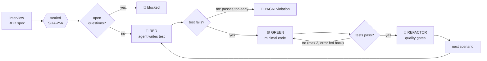

<p align="center">
  
</p>

<p align="center">
  <a href="https://github.com/jefmonjor/specforge/releases/latest"></a>
  <a href="go.mod"></a>
  <a href="LICENSE"></a>
  
</p>

<p align="center">
  <a href="#-see-it-say-no">Demo</a> ·
  <a href="#-how-it-works">How it works</a> ·
  <a href="#-quickstart">Quickstart</a> ·
  <a href="#-whats-in-the-box">Commands</a> ·
  <a href="USER_GUIDE.md">User guide</a>
</p>

---

**AI coding agents are fast and confidently wrong.** They write tests that pass before any code exists, guess at requirements nobody settled, copy logic they already wrote twice, and lose all progress when the network drops.

**SpecForge is a single Go binary that puts your agent on an assembly line.** You agree on a spec first, and SpecForge seals it. Then it drives [Claude Code](https://docs.anthropic.com/en/docs/claude-code) or [Gemini CLI](https://github.com/google-gemini/gemini-cli) through a strict **Red → Green → Refactor** loop. The agent writes the code, SpecForge checks it, and nothing moves forward until every gate passes.

> Think of it as CI for the *process*, not just the result: the agent is a fast junior developer, and SpecForge is the senior who won't approve the PR.

## 🛑 See it say no

The most useful thing a guardrail does is refuse. These are real runs of `specforge loop`, and no AI is involved: the run stops before a single token is spent.

**Open questions in the spec? The agent doesn't get to guess.**

```text
$ specforge loop --spec specs/0001-password-reset.md

==================================================================
🛑 BLOQUEO DURO: [NEEDS CLARIFICATION] DETECTADO EN LA ESPECIFICACIÓN
==================================================================
  • Causa:            Se encontraron 1 cuestión(es) abierta(s) sin resolver.
  • Regla del SDD:    La IA tiene estrictamente prohibido programar o generar tests
                      mientras quede una sola duda funcional sin aclarar por Negocio.
  • Cuestiones pendientes:
    - [NEEDS CLARIFICATION] Should the link be invalidated when a newer one is requested?
```

**Someone edited the approved spec by hand? The seal catches it.**

```text
$ sed -i 's/30 minutes/24 hours/' specs/0001-password-reset.md
$ specforge loop --spec specs/0001-password-reset.md

Error: el sello criptográfico no coincide con el contenido de la especificación
       (esperado: f15155fdec4e…, actual: be95487fb4ee…)

  • Tipo de Hallazgo: Integridad Criptográfica: Especificación BDD Alterada
```

> CLI output is in Spanish today; English output is on the [roadmap](#-status--roadmap).

## 🔧 How it works



| Stage | What the agent does | What SpecForge enforces |
| :--- | :--- | :--- |
| **Spec** | Interviews you and writes Gherkin scenarios (`specforge interview`) | Seals the spec with a SHA-256 hash. Any `[NEEDS CLARIFICATION]` blocks the loop. |
| **🔴 Red** | Writes a failing test for one scenario | Runs it. If it **passes** without an implementation, that's a YAGNI violation and the loop stops. |
| **🟢 Green** | Writes the minimum code to make it pass | Re-runs the tests and feeds the compiler or test error back to the agent, up to 3 attempts. |
| **🔵 Refactor** | Cleans up without breaking tests | Runs the quality gates for your stack and gives the agent one chance to fix the findings. |
| **Resume** | — | Saves state to `.sdd-state.json` after every step. `specforge loop --resume` picks up at the exact phase and re-checks the seal first. |

Every fix the agent needed is written to `.sdd/agent/lessons.md`. That file is part of the six-file project memory (mission, persona, forbidden patterns, glossary, golden examples, lessons) injected into every prompt, so the same mistake costs less the second time.

## ✨ What's in the box

| | Command | What it gives you |
| :---: | :--- | :--- |
| 🧭 | `init` | One-time workstation setup: picks your agent, detects Google Cloud credentials (ADC) and adds itself to your user `PATH` without admin rights. |
| 🏗️ | `setup` | Drops the SDD baseline into an existing repo **without touching your code**, or scaffolds a new one with `--stack react \| java \| go \| python`. |
| 🔎 | `ingest` | Scans the repo and writes a context pack the agent reads before working. |
| 📄 | `doc` | Converts PDF, Word and Excel files in `docs/` to Markdown using [MarkItDown](https://github.com/microsoft/markitdown), so business rules locked in documents reach the agent. |
| 🎙️ | `interview` | Socratic interview that turns a feature idea into a sealed BDD spec. `--from-repo <legacy>` extracts the business rules (the *what*) from an old codebase and leaves the obsolete tech (the *how*) behind. |
| 🔁 | `loop` | The Red → Green → Refactor assembly line described above. |
| 🛡 | `audit` | Adversarial security review inspired by Cloudflare's evaluation harness: reconnaissance, a red-team hunter and a blue-team verifier that filters false positives. `--diff` reviews only what your branch changed. |
| 🌐 | `e2e` | Drives a real Chrome or Edge through [chromedp](https://github.com/chromedp/chromedp), with no Node.js or Playwright. The agent sees a simplified DOM, picks typed actions (`click`, `type`, `wait`, `assert`) and a failure saves a screenshot. |
| 🧮 | `consistency` | Deterministic anti-contamination gate. On a legacy Java project it blocks the agent from introducing `jakarta` imports, Spring Boot dependencies or a Java 17+ compiler, and fails if the project's recorded classification is deleted or altered. |

## 🚀 Quickstart

**1. Install the binary.** Download it from the [latest release](https://github.com/jefmonjor/specforge/releases/latest):

```bash
# macOS (Apple Silicon). Swap the suffix for darwin-amd64 or linux-amd64.
curl -L -o specforge https://github.com/jefmonjor/specforge/releases/latest/download/specforge-darwin-arm64
chmod +x specforge && sudo mv specforge /usr/local/bin/
xattr -d com.apple.quarantine /usr/local/bin/specforge   # macOS Gatekeeper only
```

On Windows, download `specforge-windows-amd64.exe`, rename it to `specforge.exe` and run `specforge init` once. The binary also answers to `sdd` and `forge`.

**2. Run the line on a feature:**

```bash
specforge init                                    # once per machine
cd my-project && git checkout -b feature/password-reset
specforge setup                                   # add the SDD baseline (your code stays untouched)
specforge ingest                                  # build the context pack
specforge interview --feature "Password reset"    # agree on and seal the spec
specforge loop                                    # Red → Green → Refactor; --resume if interrupted
specforge audit --diff                            # security review of your branch
specforge e2e --url http://localhost:3000         # check the scenario in a real browser
```

### What you need

| Required | Optional, unlocks more gates |
| :--- | :--- |
| [Claude Code](https://docs.anthropic.com/en/docs/claude-code) (`claude`) **or** [Gemini CLI](https://github.com/google-gemini/gemini-cli) (`gemini`) on your `PATH`, already signed in. SpecForge drives the agent you already use and never asks for an API key. | `markitdown` for `doc` · Chrome or Edge for `e2e` · `golangci-lint`, `ruff`, `jscpd`, `knip`, `stryker`, Maven for the stack gates below |

## 🧱 Quality gates by stack

The Refactor stage chains the gates for the detected stack and stops at the first failure.

| Gate | React / Node | Java | Go | Python |
| :--- | :---: | :---: | :---: | :---: |
| Linter | ESLint (`npm run lint`) | — | `golangci-lint`, falling back to `go vet` | Ruff |
| Duplicate code | jscpd | jscpd | jscpd | jscpd |
| Dead code | Knip | — | — | — |
| Mutation testing | Stryker | — | — | — |
| Architecture rules | — | ArchUnit (`*ArchitectureTest`) | — | — |

The `react` and `java` scaffolds include these configs ready to use. The `go` and `python` scaffolds are minimal starters.

## 🧩 Under the hood

SpecForge applies to itself the architecture it asks of your code: hexagonal, with the domain free of I/O.

```text
cmd/                    Cobra commands: one file per verb
internal/
  domain/               spec parsing & sealing, TDD state machine, agent memory, diagnostics
  ports/                interfaces: AgentRunner, Compiler, QualityGate, E2EEngine, SecurityAuditor…
  adapters/
    agent/              Claude Code and Gemini CLI runners (swappable)
    compiler/           build & test dispatch per stack
    quality/            linter, jscpd, knip, stryker, ArchUnit gates
    e2e/                chromedp driver + vision agent loop
    security/           adversarial audit pipeline
    doc/ ingest/ auth/ storage/ system/
assets/baseline/        embedded templates, scaffolds and agent memory (go:embed)
```

Build from source (Go version from [`go.mod`](go.mod)):

```bash
git clone https://github.com/jefmonjor/specforge.git && cd specforge
go test ./...
go build -ldflags="-s -w" -trimpath -o specforge .
./build-all.sh            # cross-compile Windows, macOS (arm64 + amd64) and Linux into dist/
```

## 📍 Status & roadmap

SpecForge is **v3.0.0**: it builds, ships as a binary for four platforms and has unit tests across the domain, commands and most adapters. Planned next:

- [ ] CI on every push (`go vet`, `go test`, cross-platform build)
- [ ] Crash-safe state writes (temp file + rename) for `.sdd-state.json`
- [ ] Tool-dependent tests skip cleanly when a linter isn't installed
- [ ] English CLI output alongside Spanish
- [ ] Recorded demo of a full `loop` run

Ideas and bug reports are welcome in [Issues](https://github.com/jefmonjor/specforge/issues).

## 🤝 Contributing & license

Read [CONTRIBUTING.md](CONTRIBUTING.md), the [Code of Conduct](CODE_OF_CONDUCT.md) and the [security policy](SECURITY.md) before opening a PR. The full manual is in the [User & Architecture Guide](USER_GUIDE.md).

Licensed under [Apache 2.0](LICENSE). Binary distributions must include [NOTICE](NOTICE) and [THIRD-PARTY-NOTICES.md](THIRD-PARTY-NOTICES.md). The dependency and license review is in [LEGAL_AUDIT.md](LEGAL_AUDIT.md).

<p align="center"><sub>Built by <a href="https://www.jefmonjor.dev">Jefferson Montesdeoca</a> · <a href="https://github.com/jefmonjor">@jefmonjor</a></sub></p>
